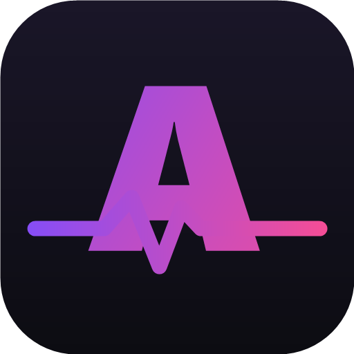

<div align="center">



# AniPulse

**Аниме-сервис с русской озвучкой: Android-приложение, веб-клиент и API-шлюз.**

[](CHANGELOG.md)
[](#android-приложение)
[](#стек)
[](#веб-клиент)
[](LICENSE)

[Сайт](https://anipulsetv.ru) · [Что нового](CHANGELOG.md) · [Документация](docs/)

</div>

---

## Что это

AniPulse — бесплатный сервис для просмотра аниме с русской озвучкой. Каталог и
метаданные берутся из [Shikimori](https://shikimori.one), видео — от нескольких
источников за общим интерфейсом. Все внешние запросы идут через собственный
API-шлюз, который решает проблемы доступности провайдеров и кеширует ответы.

Проект состоит из трёх частей:

| Каталог | Что это | Стек |
|---|---|---|
| [`app/`](app) | Нативное Android-приложение | Kotlin, Jetpack Compose, Media3, Room, Hilt |
| [`web/app/`](web/app) | Веб-клиент | Next.js 16, React 19, TypeScript, Tailwind |
| [`server/`](server) | API-шлюз и сервис аккаунтов | Node.js, Express, SQLite |

## Возможности

**Просмотр**
- Каталог Shikimori: фильтры, мультивыбор жанров, поиск с подсказками, бесконечная прокрутка
- Несколько озвучек на серию, переключение прямо в плеере
- Свой плеер на Media3: выбор качества, жесты, PiP, автопереход к следующей серии
- Метки и автопропуск опенинга/эндинга по данным AniSkip
- Скачивание серий и офлайн-плеер
- Сохранение прогресса до секунды и синхронизация между устройствами

**Аккаунт и социальное**
- Регистрация по e-mail, вход через VK ID и Яндекс ID
- Списки «Смотрю / В планах / Просмотрено», избранное, личный рейтинг
- Комментарии к сериям, личные сообщения, друзья, уведомления
- Статистика просмотра в профиле

**Оформление**
- Светлая и тёмная темы, Material 3
- Виджет «Продолжить просмотр» на рабочий стол

## Быстрый старт

### Android-приложение

Требуется JDK 17 и Android SDK 35.

```bash
git clone https://github.com/Xyling12/anime-app.git
cd anime-app
cp gradle.properties.example gradle.properties
./gradlew assembleDebug
```

Готовый APK — в `app/build/outputs/apk/debug/`.

Release-сборка подписывается ключом из `keystore.properties` (в репозиторий не
входит). Без этого файла release соберётся неподписанным — сборка не упадёт.

### Веб-клиент

```bash
cd web/app
pnpm install
pnpm dev
```

### API-шлюз

Зависимостей у шлюза нет — только стандартная библиотека Node.js 20+.
Тесты запускаются встроенным раннером:

```bash
node --test "server/tests/*.test.js"
```

Шлюзу нужны локальные файлы конфигурации (токены источников, SMTP, OAuth) — они
не хранятся в репозитории. Подробности — в [`docs/ARCHITECTURE.md`](docs/ARCHITECTURE.md)
и [`server/deploy/DEPLOY.md`](server/deploy/DEPLOY.md).

## Документация

- [Архитектура](docs/ARCHITECTURE.md) — как устроены приложение, шлюз и веб-клиент
- [Сборка и разработка](docs/DEVELOPMENT.md) — окружение, тесты, конвенции
- [Выкладка на прод](server/deploy/DEPLOY.md) — деплой шлюза, Caddy и веб-клиента
- [Безопасность](SECURITY.md) — как сообщить об уязвимости
- [Как участвовать](CONTRIBUTING.md)
- [Список изменений](CHANGELOG.md)

## Правовая информация

AniPulse не хранит и не раздаёт видеофайлы. Приложение и сайт отображают контент
сторонних общедоступных источников, права на который принадлежат их владельцам.
Обращения правообладателей — на странице
[«Правообладателям»](https://anipulsetv.ru/for-right-holders).

## Лицензия

[MIT](LICENSE) © Xyling12
